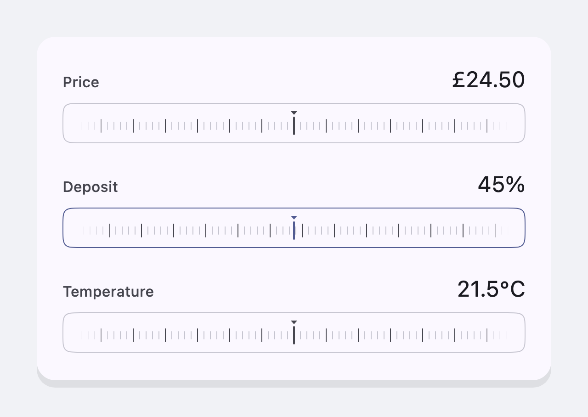
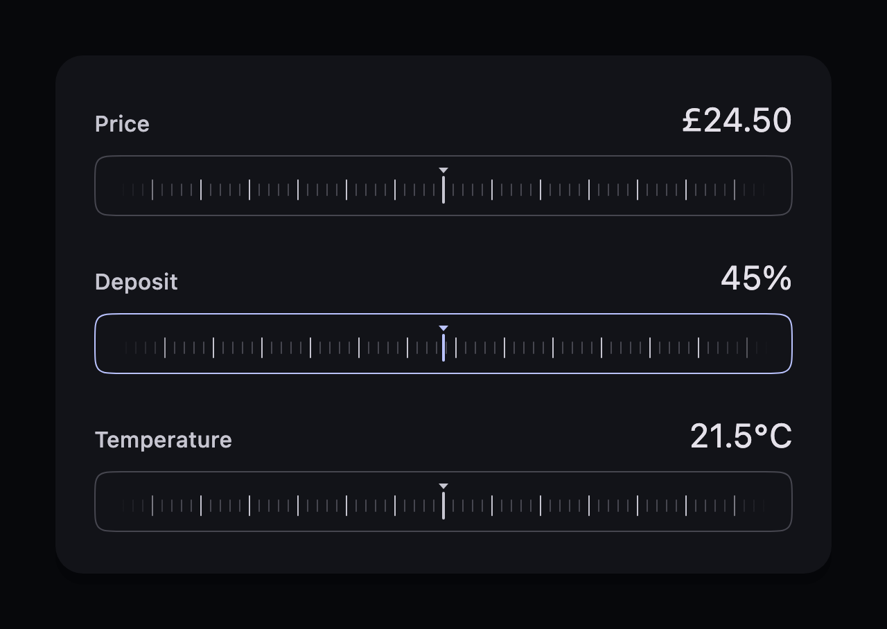

# ruler_scrubber

[](https://pub.dev/packages/ruler_scrubber)
[](LICENSE)

An accessible, performant ruler-style numeric input for Flutter. The ruler
scrolls under a stationary needle, so a wide range stays scrubbable at a fine
grain instead of being compressed into one screen width of slider track.





Both shots are of the widget itself, rendered by
[`tool/screenshot_test.dart`](tool/screenshot_test.dart) — the middle scrubber
is held mid-drag, which is why its card and needle carry the accent colour.

## Why a ruler

A slider maps its whole range onto the width of its track, so on a range of
`0…100` at a resolution of `0.01` a single pixel is worth several steps and the
exact value can only be reached by luck. A ruler decouples the two: the value
moves by `tickStep` per tick under the finger no matter how wide the range is,
and a flick coasts, so a distant value costs a gesture rather than a pixel of
travel.

## Install

```sh
flutter pub add ruler_scrubber
```

## Usage

```dart
import 'package:ruler_scrubber/ruler_scrubber.dart';

RulerScrubber(
  value: price,
  min: 0,
  max: 100,
  step: 0.01,     // the value snaps to whole pennies
  tickStep: 0.02, // one tick of ruler is worth two of them
  semanticLabel: 'Price',
  formatValue: (value) => '${value.toStringAsFixed(2)} pounds',
  onChanged: (value) => setState(() => price = value),
  onChangeEnd: (value) => context.read<Quote>().recalculate(value),
)
```

The widget is presentation only: it reports the value it was scrubbed to and
draws the value it is given. Hold that value yourself and pass it back in —
setting it from anywhere other than the ruler runs the ruler to it.

### Parameters

| Parameter | Type | Description |
| --- | --- | --- |
| `value` | `double` | Where the ruler sits. Clamped into `[min, max]`. |
| `min`, `max` | `double` | The ends of the range. |
| `tickStep` | `double` | How much the value changes over one tick — the scale of the ruler, and so how fast it moves under the finger. |
| `step` | `double?` | Granularity of the reported value. `null` scrubs continuously. |
| `onChanged` | `ValueChanged<double>` | Every value the scrub passes through. |
| `onChangeEnd` | `ValueChanged<double>?` | The value the ruler came to rest on, for work too expensive to run per frame. |
| `semanticLabel` | `String` | Spoken name of the control. |
| `formatValue` | `String Function(double)?` | Spoken form of the value. Defaults to two decimal places. |
| `style` | `RulerScrubberStyle?` | Colours and shadows. Defaults to the ambient `ThemeData`. |

`tickStep` and `step` do different jobs and are worth setting separately.
`tickStep` is the feel of the control — how far the finger travels per unit of
value. `step` is the contract with your model — which values are legal. A
`tickStep` coarser than `step` scrubs quickly but still lands on exact values.

### Styling

Omit `style` and the scrubber derives accessible defaults from the surrounding
Material theme. Pass one to use design-system tokens instead:

```dart
RulerScrubberStyle(
  backgroundColor: tokens.surface,
  borderColor: tokens.border,
  activeBorderColor: tokens.accent,
  minorTickColor: tokens.borderSubtle,
  majorTickColor: tokens.textSecondary,
  needleColor: tokens.textSecondary,
  activeShadows: const [BoxShadow(blurRadius: 12, color: Color(0x22000000))],
  activeNeedleShadows: const [BoxShadow(blurRadius: 6, color: Color(0x33000000))],
)
```

The card and needle take their `active` treatment while a scrub is in
progress — including the coast after a flick — so the field being edited is
obvious in a form full of them.

Fixed geometry (tick spacing, needle size, card radius, animation durations)
lives in `ruler_scrubber_metrics.dart` as top-level constants, if you need to
line something else up with the ruler.

## Accessibility

The scrubber presents itself as a slider to the platform's assistive
technology: `semanticLabel` is its name, `formatValue` renders its value, and
the increase/decrease actions nudge by `step` — or by a twentieth of the range
when `step` is `null`. Scrubbing clicks once per tick via
`HapticFeedback.selectionClick`, and a ruler running to a value set elsewhere
stays silent.

## Performance

The ticks are painted from the scroll offset rather than laid out inside the
scrollable, so a range worth thousands of them costs the same frame as one
worth a dozen — only the handful under the viewport is ever drawn. The painter
repaints from the scroll position alone, behind a `RepaintBoundary`, so nothing
above the ruler rebuilds while a finger is on it. The end fade is a gradient on
the tick paint rather than a mask, which keeps a scrub off the compositor.

## Example

[`example/`](example/) is a runnable app showing a price, a stepped percentage
and a scrubber styled from explicit tokens, in both brightnesses.

```sh
cd example
flutter create .   # generate the platform folders for your machine
flutter run
```

## Development

```sh
flutter analyze
flutter test
flutter test tool/screenshot_test.dart   # regenerate doc/*.png
```

The screenshots are rendered from the widget itself, so they cannot drift from
what it actually looks like. The tool needs a system font to draw real text
with; it looks for the macOS ones and fails loudly if it finds none.

## License

MIT — see [LICENSE](LICENSE).
