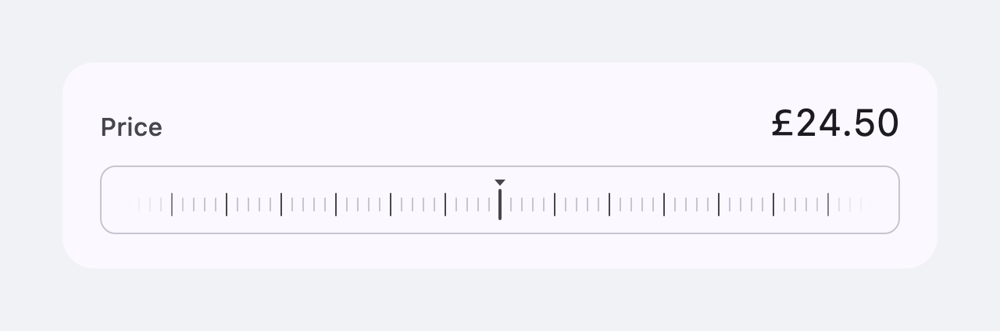
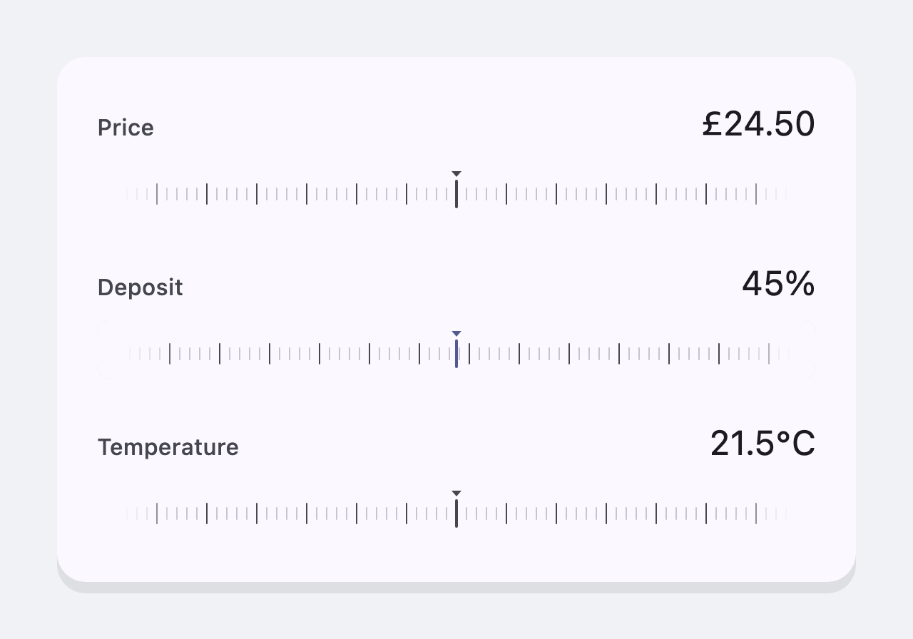
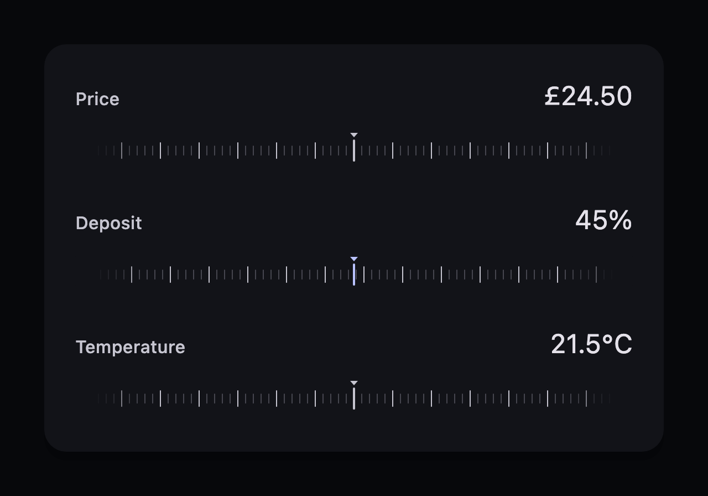

# ruler_scrubber

[](https://pub.dev/packages/ruler_scrubber)
[](https://pub.dev/packages/ruler_scrubber/score)
[](https://github.com/CtrlAltDevelop/ruler_scrubber/actions/workflows/ci.yml)
[](https://github.com/CtrlAltDevelop/ruler_scrubber/blob/main/LICENSE)

An accessible, performant ruler-style numeric input for Flutter. The ruler
scrolls under a stationary needle, so a wide range stays scrubbable at a fine
grain instead of being compressed into one screen width of slider track.



The card lights up under the finger, the value counts along with the ruler, and
the flick carries on scrolling after the finger has gone.


With `borderless: true` the card keeps its corner and background but loses its
outline, so the scrubber sits flat on the surface behind it:





All of these pictures are of the widget itself, rendered by
[`tool/screenshot_test.dart`](tool/screenshot_test.dart) and
[`tool/animation_test.dart`](tool/animation_test.dart) rather than captured by
hand. In the stills the middle scrubber is held mid-drag, which is why its card
and needle carry the accent colour.

## Why a ruler

A slider maps its whole range onto the width of its track, so on a range of
`0…100` at a resolution of `0.01` a single pixel is worth several steps and the
exact value can only be reached by luck. A ruler decouples the two: the value
moves by `tickStep` per tick under the finger no matter how wide the range is,
and a flick coasts, so a distant value costs a gesture rather than a pixel of
travel.

## Install

```sh
flutter pub add ruler_scrubber
```

Or add it to `pubspec.yaml` yourself — it is a runtime dependency:

```yaml
dependencies:
  ruler_scrubber: ">=1.2.0 <2.0.0"
  material_ui: ">=1.1.0 <2.0.0"
```

Requires Flutter 3.44.0 or newer — Dart 3.12.0 — which is `material_ui`'s own
floor.

The package is built on [`material_ui`](https://pub.dev/packages/material_ui),
the official Material Design library that used to live inside the SDK as
`package:flutter/material.dart`. If your app still imports the SDK copy, run
Flutter's own migration once and everything lines up:

```sh
dart fix --apply --code=migrate_design_widgets
```

Until you run it the scrubber still builds and scrubs normally, but it looks
for a `material_ui` theme your app does not yet provide and falls back to the
baseline Material palette rather than yours. Flutter's
`MaterialUiCompatibilityBridge` does not cover this direction — it carries a
modern theme down to legacy widgets, not the other way about. Passing an
explicit `style` skips the theme lookup altogether and is unaffected either
way.

## Usage

```dart
import 'package:ruler_scrubber/ruler_scrubber.dart';

RulerScrubber(
  value: price,
  min: 0,
  max: 100,
  step: 0.01,     // the value snaps to whole pennies
  tickStep: 0.02, // one tick of ruler is worth two of them
  semanticLabel: 'Price',
  formatValue: (value) => '${value.toStringAsFixed(2)} pounds',
  onChanged: (value) => setState(() => price = value),
  onChangeEnd: (value) => context.read<Quote>().recalculate(value),
)
```

The widget is presentation only: it reports the value it was scrubbed to and
draws the value it is given. Hold that value yourself and pass it back in —
setting it from anywhere other than the ruler runs the ruler to it.

### Parameters

| Parameter | Type | Description |
| --- | --- | --- |
| `value` | `double` | Where the ruler sits. Clamped into `[min, max]`. |
| `min`, `max` | `double` | The ends of the range. |
| `tickStep` | `double` | How much the value changes over one tick — the scale of the ruler, and so how fast it moves under the finger. |
| `step` | `double?` | Granularity of the reported value. `null` scrubs continuously. |
| `onChanged` | `ValueChanged<double>` | Every value the scrub passes through. |
| `onChangeStart` | `ValueChanged<double>?` | The value a scrub began at. |
| `onChangeEnd` | `ValueChanged<double>?` | The value the ruler came to rest on, for work too expensive to run per frame. |
| `semanticLabel` | `String` | Spoken name of the control. |
| `formatValue` | `String Function(double)?` | Spoken form of the value. Defaults to two decimal places. |
| `labelFormat` | `String Function(double)?` | Prints a number under labelled ticks. `null` — the default — draws a ruler of bare marks. |
| `labelEvery` | `int` | How many ticks apart the numbered ones are. Defaults to every major (fifth) tick. |
| `enabled` | `bool` | Whether the ruler can be scrubbed. A disabled one is dimmed and inert, still readable and still a slider. |
| `enableFeedback` | `bool` | Whether crossing a tick clicks. Turn it off on a screen with several scrubbers. |
| `focusNode`, `autofocus` | `FocusNode?`, `bool` | Take part in an existing focus traversal. |
| `physics` | `ScrollPhysics?` | Scroll physics for the ruler. Defaults to `ClampingScrollPhysics`. |
| `style` | `RulerScrubberStyle?` | Colours, card shape and shadows. Defaults to the ambient `ThemeData`. |

`tickStep` and `step` do different jobs and are worth setting separately.
`tickStep` is the feel of the control — how far the finger travels per unit of
value. `step` is the contract with your model — which values are legal. A
`tickStep` coarser than `step` scrubs quickly but still lands on exact values.

### Numbered rulers

Pass `labelFormat` to print a number under the labelled ticks:

```dart
RulerScrubber(
  value: temperature,
  min: -20,
  max: 40,
  tickStep: 0.2,
  labelFormat: (value) => '${value.round()}°',
  labelEvery: 10, // every tenth tick, rather than every fifth
  semanticLabel: 'Temperature',
  onChanged: (value) => setState(() => temperature = value),
)
```

The numbers hang below the ruler rather than moving it, so the needle stays
where it was and turning them on grows the scrubber by a fixed amount. They
fade out towards the ends exactly as the ticks do.

Each number is laid out once per step of that fade and then reused, so
numbering a ruler keeps text layout off the path of a scrub. Keep the format
cheap and stable all the same: one that returns something different for every
tick has nothing to reuse.

### Styling

Omit `style` and the scrubber derives accessible defaults from the surrounding
Material theme. Pass one to use design-system tokens instead:

```dart
RulerScrubberStyle(
  shape: const StadiumBorder(side: BorderSide(width: 1.5)),
  backgroundColor: tokens.surface,
  borderColor: tokens.border,
  activeBorderColor: tokens.accent,
  focusedBorderColor: tokens.focusRing,
  labelStyle: tokens.captionSmall,
  minorTickColor: tokens.borderSubtle,
  majorTickColor: tokens.textSecondary,
  needleColor: tokens.textSecondary,
  activeShadows: const [BoxShadow(blurRadius: 12, color: Color(0x22000000))],
  activeNeedleShadows: const [BoxShadow(blurRadius: 6, color: Color(0x33000000))],
)
```

The card and needle take their `active` treatment while a scrub is in
progress — including the coast after a flick — so the field being edited is
obvious in a form full of them.

#### The border

`shape` takes any `OutlinedBorder`, so the scrubber can be given the same
corner as everything else on your screen and this package needs no opinion
about which corner that is:

```dart
shape: const RoundedRectangleBorder(          // the default, radius 10
  side: BorderSide(width: 1),
  borderRadius: BorderRadius.all(Radius.circular(10)),
),
shape: const StadiumBorder(side: BorderSide(width: 1.5)),   // a pill
shape: const ContinuousRectangleBorder(...),                // a superellipse
shape: SmoothRectangleBorder(...),                          // figma_squircle
borderless: true,                                           // no border
```

The shape's own `side` is drawn as given, except for its colour: that comes
from `borderColor`, `focusedBorderColor` and `activeBorderColor`, so the
outline can light up while the ruler is focused or being scrubbed. Squircles work the same as anything else —
`SmoothRectangleBorder` is an `OutlinedBorder` — but they come from your
`pubspec.yaml` rather than this package's.

#### One style for the whole app

Wrap `RulerScrubberTheme` around the app — or around the one form that wants a
different treatment — instead of threading the same style through every call
site:

```dart
RulerScrubberTheme(
  style: RulerScrubberStyle.fromTheme(Theme.of(context)).copyWith(
    shape: const StadiumBorder(side: BorderSide(width: 1.5)),
    focusedBorderColor: tokens.focusRing,
  ),
  child: child,
)
```

A scrubber given a `style` of its own still wins. `RulerScrubberStyle.lerp`
interpolates between two styles if you want to animate between design states.

Fixed geometry (tick spacing, needle size, default card radius, animation
durations) lives in `ruler_scrubber_metrics.dart` as top-level constants, if
you need to line something else up with the ruler.

## Accessibility

The scrubber presents itself as a slider to the platform's assistive
technology: `semanticLabel` is its name, `formatValue` renders its value, and
the increase/decrease actions nudge by `step` — or by a twentieth of the range
when `step` is `null`. A disabled scrubber still reads as a slider, marked
unavailable rather than removed.

It is reachable without a finger too. Give it focus — with `autofocus`, with a
`focusNode` of your own, or by tabbing to it — and:

| Key | Moves |
| --- | --- |
| `→` `↑` / `←` `↓` | one nudge: `step`, or a twentieth of the range |
| `Page Up` / `Page Down` | ten nudges |
| `Home` / `End` | to `min` / `max` |

A nudge is snapped onto the same grid a scrub reports on, so the keyboard
cannot land on a value a drag never could. The card takes
`focusedBorderColor` while it holds focus, and a scrub takes focus, so the
keyboard picks up where the finger left off.

Scrubbing clicks once per tick via `HapticFeedback.selectionClick` — set
`enableFeedback: false` to turn that off — and a ruler running to a value set
elsewhere stays silent.

## Performance

The ticks are painted from the scroll offset rather than laid out inside the
scrollable, so a range worth thousands of them costs the same frame as one
worth a dozen — only the handful under the viewport is ever drawn. The painter
repaints from the scroll position alone, behind a `RepaintBoundary`, so nothing
above the ruler rebuilds while a finger is on it. The end fade is a gradient on
the tick paint rather than a mask, which keeps a scrub off the compositor.

## Example

[`example/`](example/) is a runnable app showing a price, a stepped percentage
and a scrubber styled from explicit tokens, in both brightnesses.

```sh
cd example
flutter create .   # generate the platform folders for your machine
flutter run
```

## Development

```sh
flutter analyze
flutter test
flutter test tool/screenshot_test.dart   # regenerate doc/*.png
flutter test tool/animation_test.dart    # regenerate doc/scrubbing.gif
```

The screenshots are rendered from the widget itself, so they cannot drift from
what it actually looks like. The tool needs a system font to draw real text
with; it looks for the macOS ones and fails loudly if it finds none.

## License

MIT — see [LICENSE](LICENSE).
